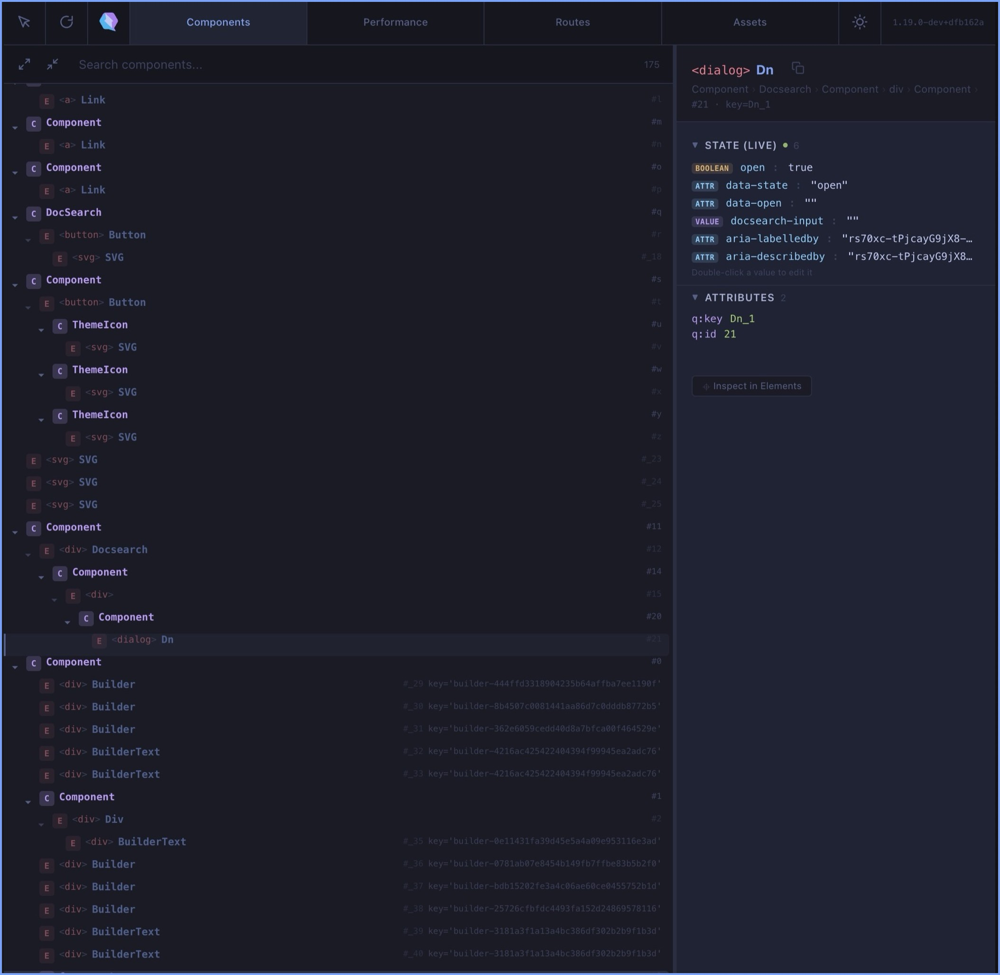
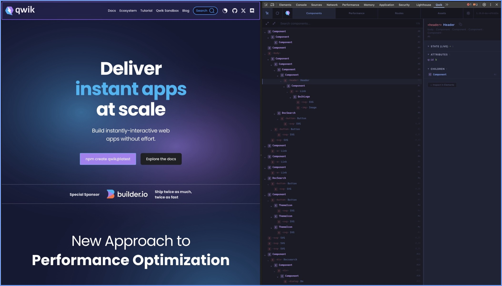
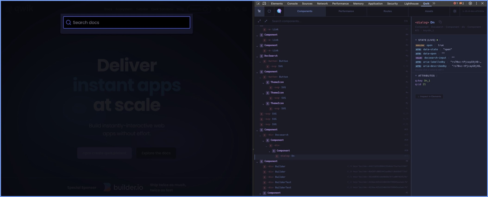
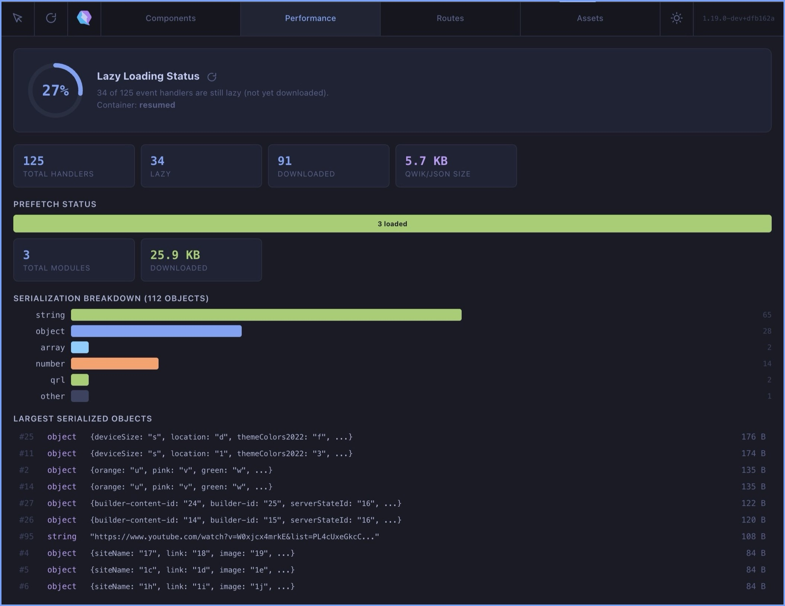
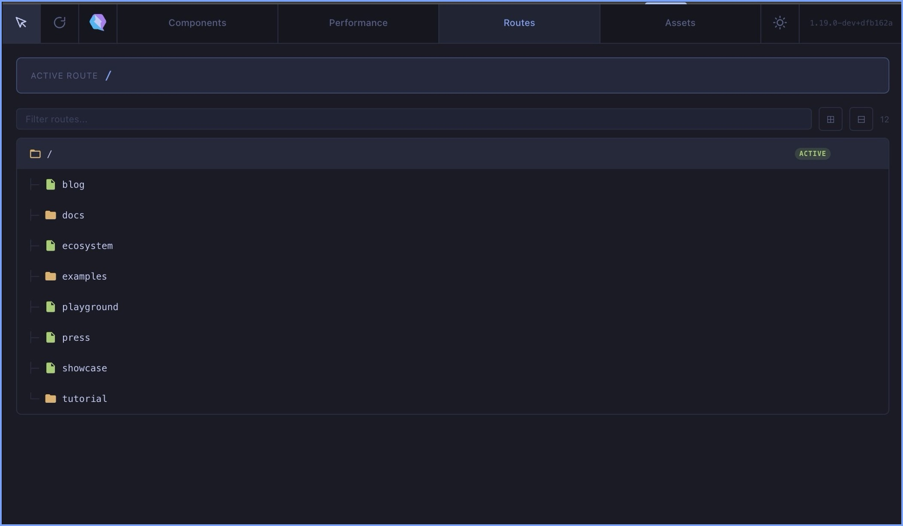
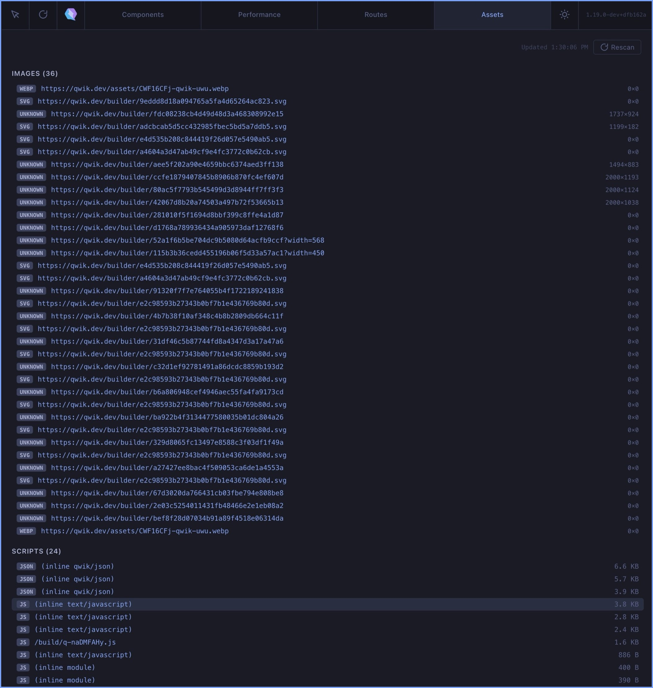

<p align="center">
  
</p>

<h1 align="center">Qwik DevTools</h1>

<p align="center">
  <strong>Developer tools for Qwik framework applications.</strong><br/>
  Inspect components, signals, state, routes and more - directly from your browser DevTools.
</p>

<p align="center">
  <a href="#installation">Installation</a> ·
  <a href="#features">Features</a> ·
  <a href="#known-limitations">Limitations</a> ·
  <a href="#development">Development</a> ·
  <a href="#contributing">Contributing</a> ·
  <a href="#roadmap">Roadmap</a>
</p>

<p align="center">
  <a href="https://github.com/Aejkatappaja/qwik-devtools/stargazers"></a>
  <a href="LICENSE"></a>
</p>

---

## Features

### Component Tree & State Inspector

Visualize the full Qwik component hierarchy (elements + virtual nodes), derived from `q:id`, `q:key`, `on:*` event attributes and `<!--qv-->` comments. Works across initial SSR and client-side SPA navigations.

- Collapsible tree with search and filtering
- State, signals, computed values and props for each component, parsed from `<script type="qwik/json">`
- Live DOM Watch: real-time monitoring of input values, checked state, aria/data attributes with inline editing
- Element Picker: click any element on the page to jump to its component in the tree

<p align="center">
  
</p>

<p align="center">
  
  <br/><em>Element Picker - click any element on the page to inspect it</em>
</p>

<p align="center">
  
  <br/><em>Live DOM Watch - real-time attributes and state monitoring</em>
</p>

### Performance & Resumability

Lazy-loading score, handler breakdown, prefetch status, and serialization analysis.

- Resumability score ring with lazy vs downloaded handler count
- Prefetch status bar and module count
- Serialization breakdown by type (string, object, array, number, QRL)
- Largest serialized objects listing

<p align="center">
  
</p>

### Routes Explorer

Detect and browse application routes with tree view, active route highlighting, and keyboard navigation.

- Active route indicator
- Filter and search routes
- Tree and list view modes

<p align="center">
  
</p>

### Assets Explorer

View all page assets (scripts, stylesheets, images, preloads) with size breakdown.

- Grouped by type: images, scripts, stylesheets, preloads
- URL, dimensions, and file size for each asset
- Rescan on demand

<p align="center">
  
</p>

### And more

- **Cross-browser** - Works on Chrome, Arc, Brave, Edge and Firefox
- **Tokyo Night Theme** - Dark and light themes with a built-in theme switcher

## Known Limitations

> **This is important to understand before using Qwik DevTools.**

Qwik's architecture is fundamentally different from React or Vue. It uses **resumability** instead of hydration, which means:

### Component tree: SSR vs SPA navigation

On **initial page load** (SSR), you get the full tree with rich component names (DocSearch, ThemeIcon, etc.) resolved from `qwik/json`. After **SPA navigation**, the tree is still available but component names fall back to DOM heuristics (tag names, CSS classes) since QRL symbols are minified in production.

See **[COMPONENT_TREE.md](COMPONENT_TREE.md)** for a detailed explanation of the tree building pipeline and naming fallback chain.

**Tip:** Reload the page (`Cmd+R` / `F5`) after SPA navigation to get the full enriched tree.

### Signals are read-only (SSR snapshot)

The state inspector shows the **initial SSR snapshot** from `<script type="qwik/json">`. After Qwik resumes, this data becomes stale - signal updates happen in memory and are not reflected back to the script tag. The Live DOM Watch feature partially compensates by reading current input values and attributes directly.

### Why not just hook into the Qwik runtime?

React DevTools uses `__REACT_DEVTOOLS_GLOBAL_HOOK__` and Vue DevTools uses `__VUE_DEVTOOLS_GLOBAL_HOOK__`. **Qwik does not have such a hook yet.** We've drafted an [RFC for `__QWIK_DEVTOOLS_HOOK__`](DEVTOOLS_HOOK_RFC.md) that would enable live signal tracking, real component names in production, and full-fidelity trees after SPA navigation. See [COMPONENT_TREE.md](COMPONENT_TREE.md#future-qwik_devtools_hook) for details.

## Installation

### Manual Install (Chrome / Arc / Brave / Edge)

1. Clone the repo and build:

   ```bash
   git clone https://github.com/Aejkatappaja/qwik-devtools.git
   cd qwik-devtools
   bun install
   bun run build
   ```

2. Go to `chrome://extensions/` (or `arc://extensions/`, `brave://extensions/`, `edge://extensions/`)
3. Enable **Developer mode**
4. Click **Load unpacked** and select the `.output/chrome-mv3/` folder
5. Open DevTools on any Qwik site - the **Qwik** tab appears automatically

### Manual Install (Firefox)

1. Build for Firefox:

   ```bash
   bun run build:firefox
   ```

2. Go to `about:debugging#/runtime/this-firefox`
3. Click **Load Temporary Add-on** and select `.output/firefox-mv2/manifest.json`

## How It Works

Qwik DevTools reads the page in three ways:

1. **DOM attributes** - `q:container`, `q:version`, `q:render`, `q:id`, `q:key`, `on:*` event handlers and `<!--qv-->` virtual node comments to build the component tree. After SPA navigation, elements without `q:id` are still detected via `q:key` and event handler attributes.
2. **Serialized state** - Parses `<script type="qwik/json">` to extract signals, computed values, QRLs, element refs and subscriptions (the SSR snapshot). Enriches component names from QRL symbols when available.
3. **Live DOM** - Uses `inspectedWindow.eval()` to read current input values, checked states, aria attributes and data attributes in real-time

### Architecture

```
Page DOM <-- Content Script (reads DOM + qwik/json)
                 | chrome.runtime messages
           Background Service Worker (relay by tabId)
                 | chrome.runtime.connect port
           DevTools Panel (Lit Web Components)
               |-- DevToolsStore (state + sync + retry)
               |-- PageBridge (typed eval API)
               |-- Components (tree, detail, routes, assets, perf)
```

## Development

### Prerequisites

- [Bun](https://bun.sh/) (package manager)
- Chrome, Arc, Brave, Edge or Firefox

### Setup

```bash
bun install
```

### Commands

| Command                 | Description                        |
| ----------------------- | ---------------------------------- |
| `bun run dev`           | Start dev server with HMR (Chrome) |
| `bun run dev:firefox`   | Start dev server (Firefox)         |
| `bun run build`         | Production build (Chrome MV3)      |
| `bun run build:firefox` | Production build (Firefox MV2)     |
| `bun run test`          | Run unit tests                     |
| `bun run test:watch`    | Run tests in watch mode            |
| `bun run lint`          | Lint with Biome                    |
| `bun run lint:fix`      | Lint and auto-fix with Biome       |
| `bun run format`        | Format code with Biome             |
| `bun run zip`           | Create distributable zip (Chrome)  |
| `bun run zip:firefox`   | Create distributable zip (Firefox) |

### Stack

- **[WXT](https://wxt.dev/)** - Extension framework (Vite-based, cross-browser)
- **[Lit](https://lit.dev/)** - Web Components for the DevTools panel UI
- **[TypeScript](https://www.typescriptlang.org/)** - Type safety
- **[Vitest](https://vitest.dev/)** - Unit testing
- **[Biome](https://biomejs.dev/)** - Linting and formatting

### Project Structure

```
src/
├── entrypoints/
│   ├── devtools.html         # Creates the panel (only if Qwik detected)
│   ├── panel.html            # Panel shell + port setup
│   ├── background.ts         # Service worker (message relay)
│   └── content.ts            # Content script (DOM extraction + element picker)
├── components/
│   ├── devtools-root.ts      # Root shell (rendering only, state in store)
│   ├── components-tab.ts     # Component tree + detail layout
│   ├── detail-panel.ts       # Component detail (signals, state, props, attrs)
│   ├── routes-tab.ts         # Route tree with keyboard nav
│   ├── assets-tab.ts         # Asset listing (scripts, styles, images)
│   ├── performance-tab.ts    # Resumability analysis + score ring
│   ├── detail-sections/      # Sub-components for the detail panel
│   │   ├── live-editor.ts         # Live DOM polling + inline editing
│   │   └── component-actions.ts   # Inspect / Open in Editor buttons
│   └── shared/               # Reusable UI (tab-bar, tree-node, json-tree, icons, toast, error-boundary)
├── lib/
│   ├── types.ts              # All shared TypeScript interfaces
│   ├── constants.ts          # Named constants + regex patterns + helpers
│   ├── devtools-store.ts     # Centralized state store (port, retry, messaging)
│   ├── page-bridge.ts        # Typed remote API over inspectedWindow.eval()
│   ├── eval-scripts.ts       # Eval script builders + safeEval with timeout
│   ├── message-bus.ts        # Typed message dispatcher (on/off/dispatch)
│   ├── component-tree-builder.ts  # Builds + enriches component tree from DOM
│   ├── naming-heuristics.ts  # Component name derivation from classes, keys, QRLs
│   ├── tree-cleaner.ts       # Tree noise reduction (CSS hashes, boring tags)
│   ├── state-display.ts      # Value formatting helpers for the UI
│   ├── qwik-detector.ts      # Detects Qwik via q:container attribute
│   ├── qwik-state-parser.ts  # Parses <script type="qwik/json"> + prefix decoding
│   ├── route-explorer.ts     # Route detection from page links
│   ├── asset-explorer.ts     # Asset extraction eval script
│   └── resumability-analyzer.ts   # Resumability analysis eval script
└── styles/
    └── global.css            # Tokyo Night dark + light theme variables
```

## Contributing

Contributions are welcome! Here are some areas where help is needed:

- **`__QWIK_DEVTOOLS_HOOK__` proposal** - Help us propose a runtime hook to the Qwik core team (see [RFC](DEVTOOLS_HOOK_RFC.md))
- **Better component names** - Improve heuristics for deriving readable names from production (hashed) builds, especially after SPA navigation when `qwik/json` enrichment is unavailable
- **Signal editing** - Allow editing signal values from the DevTools panel
- **Performance profiling** - Add a timeline tab to track component re-renders

### Getting Started

1. Fork the repo
2. Create a branch (`git checkout -b feature/my-feature`)
3. Make your changes
4. Run tests (`bun run test`)
5. Build and test manually (`bun run build`, load in browser)
6. Submit a PR

## Roadmap

- [ ] Publish on Chrome Web Store & Firefox Add-ons
- [ ] `__QWIK_DEVTOOLS_HOOK__` - Propose runtime hook to Qwik core for live signal tracking and real component names in production
- [ ] Signal editing (write values back from the panel)
- [ ] Performance timeline (track re-renders)
- [ ] Source maps integration (real component names in production)

## Acknowledgments

- [Qwik](https://qwik.dev/)
- [Lit](https://lit.dev/)
- [WXT](https://wxt.dev/)
- [Tokyo Night](https://github.com/folke/tokyonight.nvim)

## License

[MIT](LICENSE)
